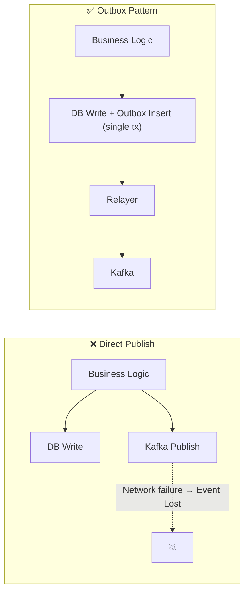
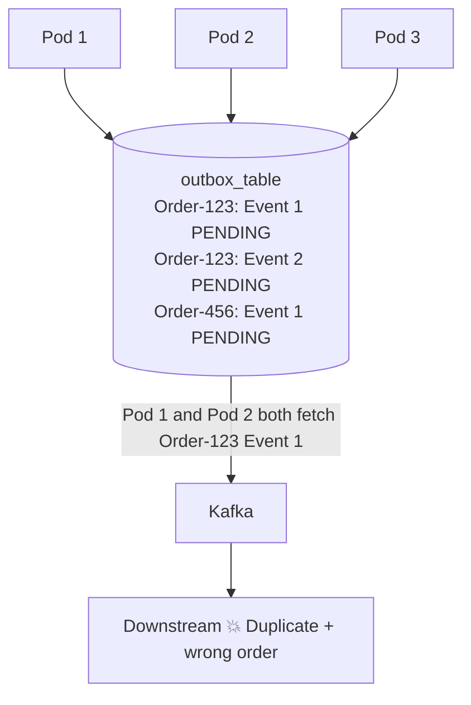
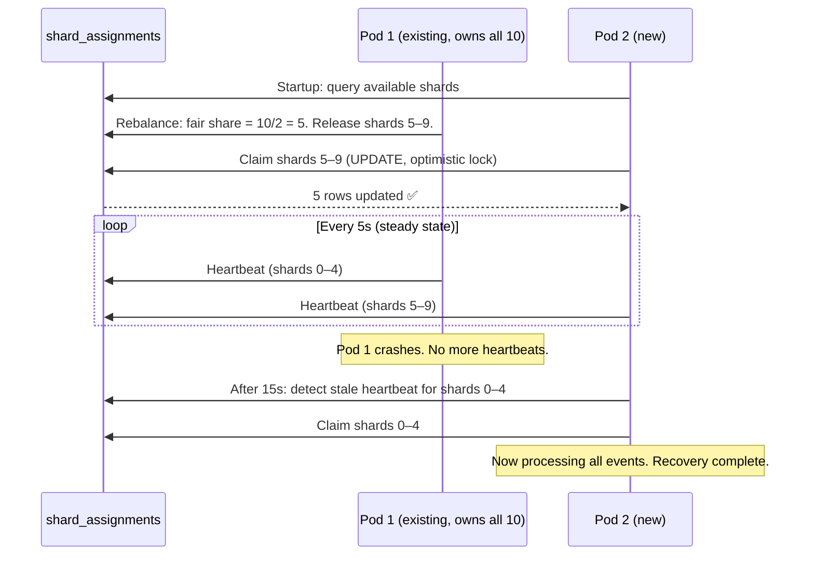
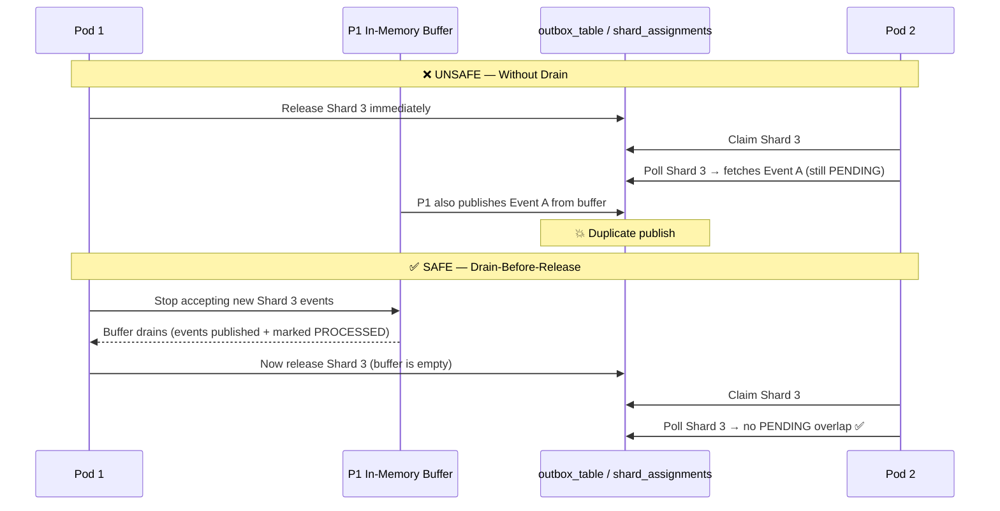
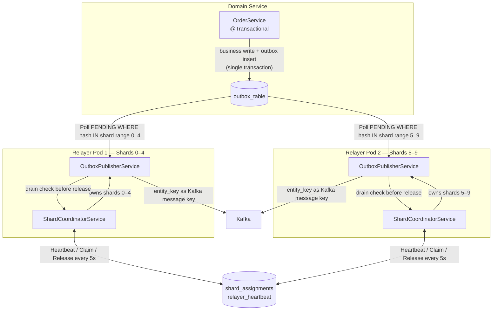
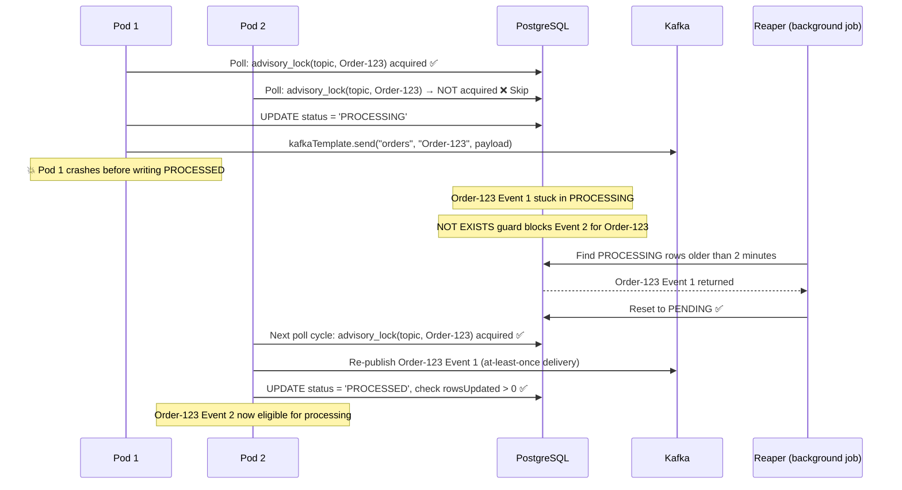
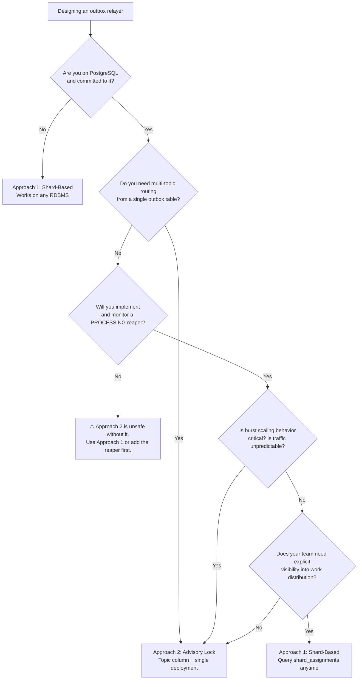

# Building a Debezium-Free Outbox Relayer
## Database Sharding vs. PostgreSQL Advisory Locks — A Production Tradeoff

*For Staff and Senior Backend Engineers. Estimated read time: 30 minutes.*

---

It was a routine Kubernetes scale-out event. Three new relayer pods joined the deployment in response to an uptick in traffic. Within seconds, the same order event had been published to Kafka twice — in different sequence — and the downstream billing system had processed both. No alert fired. The customer received two invoices.

The incident post-mortem was humbling because the failure was not subtle. It was a race condition we had introduced ourselves, hidden inside a design decision that looked correct on a whiteboard and broke silently under load.

The root cause was not Kafka. It was not the application code. It was the gap between our database transaction and our event delivery — and the coordination mechanism we had chosen to bridge it.

---

> **What you'll learn:**
> Why we evaluated and rejected Debezium in favor of a custom outbox relayer. How two fundamentally different concurrency strategies — database sharding with heartbeat coordination, and PostgreSQL advisory locks — solve the same underlying problem with opposite tradeoffs. The specific failure modes each approach introduces, including the one that caused our billing incident. And the organizational and technical factors that should determine which approach you choose.

---

## Section 1: The Dual-Write Problem

Every event-driven service eventually confronts the same constraint: a business operation that must both update a database and notify downstream systems via an event broker. These are two separate I/O operations, and they cannot be made atomically consistent by default. If the database commits and Kafka publish fails, the event is lost and downstream systems diverge silently. If Kafka fires and the database subsequently rolls back, an event exists for a business state that never materialized. If the application crashes between the two, the outcome is unpredictable — and whether you get a duplicate or a lost event depends on where exactly the crash landed.

The standard solution to this is the outbox pattern. Instead of writing to Kafka directly, you append an event record to a dedicated `outbox_events` table *inside the same database transaction* as your business write. A separate process — the relayer — polls that table and publishes events to Kafka asynchronously. Atomicity is the database's job. Delivery is decoupled entirely from the write path.



The pattern is well-understood. The interesting engineering challenge is not whether to use it — it is how to implement the relayer when your requirements include horizontal scalability, per-entity event ordering, and no tolerance for duplicate publishing during pod scale events. That is where the design space opens up, and where the choices matter.

---

## Section 2: Why Not Debezium?

The obvious answer to "how do I implement an outbox relayer" is: don't. Use Debezium or another CDC tool to tail your database's write-ahead log and stream events to Kafka automatically. It is the right answer for a large class of systems. We evaluated it seriously before building anything custom, and it deserves a fair accounting before we explain why we went a different direction.

### What Debezium Gets Right

Debezium is genuinely excellent at what it does. It tails the database WAL in near-real-time, which means events reach Kafka with minimal latency and zero polling overhead. It requires no changes to your Kafka producer code — the outbox table is just a table, and Debezium observes it externally. It is battle-tested at scale and has a rich ecosystem of connectors, transforms, and integrations. For teams that already run Kafka Connect and whose event payloads map cleanly to database rows, it is the lowest-effort path to a reliable outbox.

### The Evaluation

We ran Debezium against our specific requirements and found four points of friction.

| Criterion | Debezium / Kafka Connect | Custom Relayer |
|-----------|--------------------------|----------------|
| Custom event payload shape | Requires SMT chains; complex to maintain | Native — shape events at poll time |
| Infrastructure ownership | Requires a managed Kafka Connect cluster | Spring Boot service; same infra you already run |
| Kubernetes-native horizontal scaling | Connector instances don't scale like pods | HPA-compatible; scale with a single `replicas` change |
| Payload enrichment at publish time | Joins require KSQL or external stream processors | Simple — query the DB at poll time |
| Time to first event in production | High (connector setup, schema registry, offset management) | Low (code-owned, standard deployment pipeline) |
| Operational blast radius | A single connector failure stalls all streams routed through it | Single relayer failure stalls one domain |
| Team expertise required | Kafka Connect internals, SMT debugging, connector offsets | Spring Boot, PostgreSQL — already on the team |

### The Recommendation

If your event payloads map 1:1 to database rows and your team owns a running Kafka Connect cluster, use Debezium. It is the right tool and this article is not for you.

We chose differently for three reasons that were specific to our situation. Our event payloads required business logic enrichment that Single Message Transforms could not express cleanly — we needed to join against other tables at publish time, not at write time. We did not own the Kafka Connect cluster; it was managed by a platform team with a separate deployment cadence and incident response process. And our relayer needed to scale as a Kubernetes deployment — adding pods, triggering on HPA metrics — not as a connector instance with a separate scaling model.

If any of those three conditions match yours, read on.

### Other Approaches Considered and Rejected

**PostgreSQL logical replication slots:** Requires superuser privileges and introduces WAL retention risk if the consumer falls behind — the WAL will grow unboundedly until the slot catches up. Operationally heavier than it appears from the documentation.

**Direct Kafka publish inside `@Transactional`:** Does not provide atomicity guarantees. Kafka transactions and database transactions are independent session constructs. You cannot enlist both in a single atomic commit without XA transactions, which carry their own substantial complexity and performance overhead. Teams do ship this pattern for non-critical notifications where occasional duplicate or lost events are tolerable, but it is not suitable for systems where events drive downstream state.

**Kafka Streams with a changelog topic:** Solves a stream processing problem, not a transactional outbox problem. The semantics are different and the operational footprint is larger.

---

## Section 3: Designing the Relayer — Constraints First

We started with failure modes, not features. The billing incident was not a theoretical concern — it had already happened in a staging environment during a load test that involved a rapid scale-out. That experience produced a concrete list of requirements, each traceable to a specific observed failure.

### Non-Negotiable Requirements

The scale-out incident had three root causes:

1. Two pods processed the same event simultaneously — **missing mutual exclusion**.
2. A pod released its work partition while its in-memory buffer still held unprocessed events — **unsafe handover**.
3. There was no bounded time limit on how long a dead pod's work remained unrecovered — **undetected orphans**.

These became the requirements:

1. **Mutual exclusion per entity key.** No two pods may concurrently process events for the same entity key. Events for `Order-123` and `Order-456` may be processed in parallel. Events for two different instances of `Order-123` may not.
2. **Per-entity FIFO ordering.** Event 2 for `Order-123` must not reach Kafka before Event 1 for `Order-123`, regardless of which pod processes each.
3. **Bounded failover.** If a pod dies, its work must be recoverable within a defined window. We targeted 30 seconds.
4. **Safe handover under scale events.** Work must not be double-processed during pod scale-out or scale-in.
5. **No external dependencies beyond the existing stack.** PostgreSQL, Spring Boot, and Kafka only. No ZooKeeper, no Redis, no etcd.

Both approaches presented here satisfy requirements 1, 2, 4, and 5. Requirement 3 — 30-second bounded failover — is met by Approach 1 via its configurable heartbeat TTL. Approach 2's default configuration produces a worst-case recovery window of approximately 2.5 minutes (PROCESSING TTL + reaper interval). Teams choosing Approach 2 should either reduce both values to approach the 30-second target, or consciously accept a longer recovery window in exchange for simpler coordination.

### The Central Design Question

Given those constraints, the core problem is this: how do you let N relayer pods poll the same outbox table concurrently without violating mutual exclusion or ordering?



Two philosophically different answers emerged.

**Divide before polling.** Pre-assign the event space into partitions. Each pod owns an exclusive subset. No pod ever polls another pod's data. Mutual exclusion is structural, not transactional.

**Race with locks.** Let all pods poll freely. Use database-level locks to ensure that only one pod can act on a given entity key at any moment. Mutual exclusion is runtime, not structural.

---

## Section 4: Approach 1 — Database-Sharded Outbox with Heartbeat Coordination

### Core Idea

Hash each entity key using SHA-256 and map the result to an integer in the range 0–999. Pre-create N shards, each covering a contiguous hash range. Each relayer pod claims exclusive ownership of a subset of shards and polls only for events whose entity key hashes into that range.

The result is a system where mutual exclusion is enforced structurally: two pods never process events for the same entity key because they never poll the same shard. The only coordination needed is: which pod owns which shard right now?

### Schema

```sql
CREATE TABLE outbox_table (
    id           SERIAL PRIMARY KEY,
    entity_key   TEXT NOT NULL,
    payload      TEXT NOT NULL,
    status       TEXT NOT NULL DEFAULT 'PENDING', -- PENDING, PROCESSED
    created_at   TIMESTAMP DEFAULT NOW()
);

-- Coordination table: who owns which shard
CREATE TABLE shard_assignments (
    shard_id       SERIAL PRIMARY KEY,
    start_hash     INT NOT NULL,
    end_hash       INT NOT NULL,
    instance_id    TEXT,           -- NULL means available
    heartbeat_time TIMESTAMP
);

-- Liveness tracking for active relayer instances
CREATE TABLE relayer_heartbeat (
    instance_id    VARCHAR PRIMARY KEY,
    heartbeat_time TIMESTAMP
);

-- Pre-populate 10 shards covering hash range 0–999
INSERT INTO shard_assignments (start_hash, end_hash) VALUES
  (0, 99), (100, 199), (200, 299), (300, 399), (400, 499),
  (500, 599), (600, 699), (700, 799), (800, 899), (900, 999);
```

### Choosing Shard Count — The Decision That v1 Skipped

Shard count is fixed at deployment time. Changing it requires updating `shard_assignments` rows and coordinating a restart across all relayer pods. The non-trivial part is not the migration itself — it is ensuring zero duplicate processing during the restart window, when some pods have restarted with the new mapping and others have not. Plan this as a coordinated rollout, not a rolling restart.

The practical rule is: `shard_count = max_expected_concurrent_pods × 2`.

The 2× factor gives headroom for burst scaling without requiring a migration. If you expect to run at most 5 pods under peak conditions, 10 shards is the right starting point. At normal load with 2 pods, each pod owns 5 shards. During a spike to 4 pods, each pod owns 2–3. If you need to temporarily run 8 pods, 2 pods will each own 1 shard and the remaining 2 will be idle — that's your signal to plan a shard count increase.

Note that this formula assumes reasonably uniform distribution of entity keys across shards. With a heavily skewed key distribution — where a small fraction of entity keys account for the majority of events — some shards will be consistently busier than others regardless of shard count. Monitor per-shard event throughput and rebalance shard ranges manually if skew becomes significant.

Document the chosen shard count as a comment in your schema migration. It will save a significant debugging session when a new team member tries to scale past the shard count ceiling six months from now.

### Entity Key Hashing

```java
public int getStrongHash(String entityKey) {
    try {
        MessageDigest digest = MessageDigest.getInstance("SHA-256");
        byte[] hashBytes = digest.digest(entityKey.getBytes(StandardCharsets.UTF_8));
        ByteBuffer buffer = ByteBuffer.wrap(hashBytes);
        int hash = buffer.getInt() & Integer.MAX_VALUE;
        return hash % 1000; // Map to 0–999
    } catch (NoSuchAlgorithmException e) {
        throw new RuntimeException("SHA-256 not available", e);
    }
}

public int getShardId(String entityKey) {
    return getStrongHash(entityKey) / (1000 / shardCount);
}
```

Using SHA-256 rather than a simpler hash like `hashCode()` matters here for two reasons: Java's `String.hashCode()` is not guaranteed to be stable across JVM versions or implementations, making it unsuitable for a value stored in a database; and cryptographic hashes resist adversarial input distributions in ways that polynomial hashes do not. SHA-256 gives consistent, reproducible distribution across the hash space regardless of key structure or runtime environment.

One minor note: taking the first 4 bytes of SHA-256 output and applying `% 1000` introduces a marginally non-uniform distribution because `Integer.MAX_VALUE` is not divisible by 1,000. The skew is approximately one part in 2.1 million per bucket — negligible for shard assignment purposes, but worth acknowledging if your team is sensitive to distribution guarantees.

### Lifecycle: Claim → Heartbeat → Rebalance → Release

The shard-based relayer has a four-phase lifecycle. Understanding all four is required to understand the failure modes.

**Phase 1 — Claim (on startup)**

When a pod starts, it queries for claimable shards — those with no current owner, or those whose owner's heartbeat has expired:

```sql
SELECT shard_id FROM shard_assignments
WHERE instance_id IS NULL
   OR heartbeat_time < NOW() - INTERVAL '15 seconds';
```

For each claimable shard, it attempts to claim it with an optimistic lock:

```sql
UPDATE shard_assignments
SET instance_id = ?, heartbeat_time = NOW()
WHERE shard_id = ?
  AND (instance_id IS NULL OR heartbeat_time < NOW() - INTERVAL '15 seconds');
```

Two pods can simultaneously read the same stale shard and both attempt this `UPDATE`. That is safe. The `UPDATE` is atomic at the database level — exactly one pod's update will match the `WHERE` clause for any given row. The other pod gets `rowsUpdated = 0` and skips that shard. This is optimistic locking via predicate, with no explicit lock or coordination service required.

**Phase 2 — Heartbeat (steady state)**

Every 5 seconds, each pod upserts its liveness record and refreshes the `heartbeat_time` on all shards it owns:

```java
@Scheduled(fixedRateString = "${outbox.relayer.heartbeat-interval-ms}")
public void sendHeartbeat() {
    jdbcTemplate.update(
        "INSERT INTO relayer_heartbeat (instance_id, heartbeat_time) VALUES (?, ?) " +
        "ON CONFLICT (instance_id) DO UPDATE SET heartbeat_time = EXCLUDED.heartbeat_time",
        instanceId, Timestamp.from(Instant.now())
    );
    for (Integer shardId : acquiredShards) {
        jdbcTemplate.update(
            "UPDATE shard_assignments SET heartbeat_time = ? WHERE shard_id = ? AND instance_id = ?",
            Timestamp.from(Instant.now()), shardId, instanceId
        );
    }
}
```

A pod that stops sending heartbeats has its shards become claimable after the TTL (15 seconds in this configuration). The TTL is your failover SLA — more on that in the production lessons.

**Phase 3 — Rebalance (scale-out)**

When a new pod joins, it computes the fair share of shards based on the current count of live instances:

```java
@Scheduled(fixedRateString = "${outbox.relayer.rebalance-interval-ms}")
public void rebalanceShards() {
    int totalShards = countTotalShards();
    int liveInstances = countLiveInstances(); // Based on recent heartbeats
    if (liveInstances <= 0) return;

    int fairShare = totalShards / liveInstances;
    int excess = acquiredShards.size() - fairShare;

    if (excess > 0) {
        List<Integer> toRelease = acquiredShards.subList(0, excess);
        for (Integer shardId : new ArrayList<>(toRelease)) {
            if (!pendingShardTracker.hasUnprocessedEvents(shardId)) {
                jdbcTemplate.update(
                    "UPDATE shard_assignments SET instance_id = NULL, heartbeat_time = NULL " +
                    "WHERE shard_id = ? AND instance_id = ?",
                    shardId, instanceId
                );
                acquiredShards.remove(shardId);
            }
        }
    }
}
```

`countLiveInstances()` should be implemented with a recency filter to avoid counting stale heartbeat rows:

```java
private int countLiveInstances() {
    return jdbcTemplate.queryForObject(
        "SELECT COUNT(*) FROM relayer_heartbeat WHERE heartbeat_time >= NOW() - INTERVAL '15 seconds'",
        Integer.class
    );
}
```

The recency filter ensures that crashed pods are not counted as live after their TTL expires. Schedule a cleanup job to remove heartbeat rows older than a few minutes — not because they affect `countLiveInstances()`, but to keep the table from accumulating indefinitely.

The `if (!pendingShardTracker.hasUnprocessedEvents(shardId))` check is critical and deserves its own section.

**Phase 4 — Failover (pod death)**

When a pod dies, its heartbeat stops. After 15 seconds, the orphaned shards become claimable. On the next coordination check (every 10 seconds), surviving pods detect and claim them. Total recovery time: up to heartbeat TTL + coordination interval = up to 25 seconds in the default configuration. Tunable, but with a direct tradeoff against the false-positive rate for considering a slow-but-live pod dead.



### Production Lesson: Drain-Before-Release

This is the design decision that the billing incident taught us. It is the subtlest failure mode in the shard-based approach, and it is entirely self-inflicted if you miss it.

Here is the failure scenario without drain-before-release:

1. Pod 1 owns Shard 3. It polls 50 events from Shard 3 into its in-memory buffer. Status in the DB: still PENDING.
2. A new pod (Pod 2) starts. Pod 1 computes that it holds more than its fair share. It releases Shard 3 in `shard_assignments`.
3. Pod 2 sees Shard 3 as unclaimed. It claims it and immediately polls for PENDING events in Shard 3. It finds the same 50 events (still PENDING in the DB — Pod 1 hasn't marked them PROCESSED yet).
4. Both Pod 1 and Pod 2 publish those 50 events to Kafka.
5. The downstream billing system processes 50 duplicates.

The fix requires that before a pod releases any shard, it must confirm that its in-memory buffer contains zero pending events for that shard. This means:

1. Maintaining a `Map<Integer, Set<Long>> shardToEventIds` — tracking which event IDs are currently in the buffer, keyed by shard. Use `ConcurrentHashMap` with concurrent-safe Set values, as the polling loop and rebalancing logic run on separate scheduled threads.
2. When events are polled, adding their IDs to the relevant shard's set.
3. When events are marked PROCESSED, removing their IDs from the set.
4. Only releasing a shard when `shardToEventIds.get(shardId)` is empty.

```java
@Override
public boolean hasUnprocessedEvents(int shardId) {
    return shardToEventIds.containsKey(shardId)
        && !shardToEventIds.get(shardId).isEmpty();
}
```

The drain adds at most one poll cycle of latency to a shard handover — typically less than a second. In exchange, you eliminate the entire class of duplicate-publish failures during scale events.



### Full Architecture



### Configuration

```yaml
outbox:
  relayer:
    table-name: outbox_table
    kafka-topic: domain-events
    shard-count: 10
    heartbeat-interval-ms: 5000     # How often to refresh shard ownership
    shard-check-interval-ms: 10000  # How often to check for claimable shards
    rebalance-interval-ms: 30000    # How often to check for over/under holding
    # instance-id is auto-generated (UUID) unless overridden
```

### Operational Cost Assessment

**What you get:** Explicit, queryable ownership — at any moment you can query `shard_assignments` to see exactly which pod owns which shard. Works on any relational database with standard SQL. Predictable per-pod workload with no hot-key contention because each entity key maps deterministically to exactly one shard. The PENDING → PROCESSED status transition is simpler than Approach 2 (no PROCESSING intermediate state).

**What you pay:**

- Shard count changes require a coordinated rollout — the migration SQL is trivial, but ensuring zero duplicate processing during the restart window requires care.
- Three tuning parameters interact with each other: heartbeat interval, shard TTL, and rebalance interval. Getting these wrong produces either false-positive shard reclaims (too aggressive) or slow failover recovery (too conservative).
- Drain-before-release adds implementation complexity that must be tested explicitly under scale events, and requires thread-safe data structures since polling and rebalancing run on separate threads.
- Schedule a cleanup job for `relayer_heartbeat` rows older than a few minutes to keep the table from growing indefinitely.

---

## Section 5: Approach 2 — PostgreSQL Advisory Lock–Based Relayer

### Core Idea

No pre-assignment. No coordination tables. All pods poll freely. PostgreSQL's `pg_try_advisory_xact_lock` is the only coordination mechanism. If a pod acquires the advisory lock for a given entity key, it processes those events. If it cannot acquire the lock — because another pod already holds it — it skips those events and moves to the next entity key. Locks are held for the duration of the database transaction and are released automatically on commit or rollback.

The entire coordination system is a single SQL primitive. There are no coordination tables to maintain, no heartbeats to send, no rebalancing logic to write, and no drain-before-release to implement. Pods are fully symmetric — any pod can process any event.

### The Polling Query — Annotated

The heart of this approach is a single CTE query that atomically locks, filters, and claims events for processing:

```sql
WITH pulled_tasks AS (
    SELECT id, entity_key, topic_name, payload
    FROM outbox_table ot
    WHERE status = 'PENDING'

      -- Advisory lock: acquire a transaction-scoped lock keyed on (topic_name, entity_key).
      -- pg_try_advisory_xact_lock takes two int4 arguments; hashtext() produces int4.
      -- pg_try returns FALSE immediately (non-blocking) if another transaction holds the lock.
      -- Only rows where we successfully acquire the lock pass this filter.
      AND pg_try_advisory_xact_lock(
            hashtext(topic_name)::int,
            hashtext(entity_key)::int
          )

      -- Ordering guard: do not process Event N if Event N-1 is still PROCESSING.
      -- This is the mechanism that guarantees per-entity FIFO under concurrent pods.
      AND NOT EXISTS (
            SELECT 1 FROM outbox_table sub_ot
            WHERE sub_ot.entity_key = ot.entity_key
              AND sub_ot.topic_name = ot.topic_name
              AND sub_ot.status = 'PROCESSING'
          )

    ORDER BY created_at  -- FIFO within each entity key
    FOR UPDATE SKIP LOCKED  -- Row-level non-blocking lock: prevents two pods from locking the same row
    LIMIT 100
)
UPDATE outbox_table
SET status = 'PROCESSING', updated_at = NOW()
WHERE id IN (SELECT id FROM pulled_tasks)
RETURNING id, topic_name, entity_key, payload;
```

> **Critical: this query must execute inside a single database transaction.** `pg_try_advisory_xact_lock` acquires a *transaction-scoped* lock, which means it is automatically released when the transaction commits or rolls back. If this query runs in auto-commit mode (the default for individual `JdbcTemplate` statements), the lock is acquired and immediately released before the UPDATE runs — providing zero mutual exclusion. The method calling this query must be annotated `@Transactional`, or wrapped in an explicit `TransactionTemplate`.

```java
@Transactional  // Required: holds the advisory lock for the duration of the UPDATE
public List<OutboxEvent> fetchAndMarkProcessingEvents() {
    String sql = /* the CTE above */;
    return jdbcTemplate.query(sql, (rs, rowNum) -> new OutboxEvent(
        rs.getLong("id"),
        rs.getString("topic_name"),
        rs.getString("entity_key"),
        rs.getString("payload")
    ));
}
```

A note on hash collisions: `hashtext()` is a 32-bit hash function. With very high entity key cardinality, two distinct entity keys can produce the same `hashtext()` value, causing their advisory locks to be shared. This does not produce correctness violations — the ordering guarantee and mutual exclusion still hold — but it creates unnecessary serialization between two unrelated entity keys. Collisions are rare but possible; acknowledge this if key cardinality is in the hundreds of millions.

A common question is why both `FOR UPDATE SKIP LOCKED` and `pg_try_advisory_xact_lock` are needed — they look like they solve the same problem. They do not.

`FOR UPDATE SKIP LOCKED` is a row-level lock. It prevents two database transactions from locking the same *row* simultaneously. Without it, two pods can read the same row in their SELECT and both attempt to UPDATE it — a classic lost-update scenario. `SKIP LOCKED` causes the second transaction to skip already-locked rows rather than wait.

`pg_try_advisory_xact_lock` is an application-semantic lock, keyed on an arbitrary integer derived from your `entity_key`. It prevents two pods from processing any events for the same entity key, even across different rows. Two events for `Order-123` live on different rows. `FOR UPDATE SKIP LOCKED` cannot see the relationship between them. The advisory lock can, because both events hash to the same lock key.

You need both: `SKIP LOCKED` prevents the row race; the advisory lock prevents the entity race.

### The Ordering Guarantee — Proof, Not Assertion

The combination of the advisory lock and the `NOT EXISTS` guard produces a per-entity FIFO guarantee that holds under concurrent pod operation and even pod failure. It is worth understanding exactly why.

**Normal case:** Pod 1 is processing Event 1 for `Order-123` (status = PROCESSING). Pod 2 polls and finds Event 2 for `Order-123` (status = PENDING). Pod 2's query calls `pg_try_advisory_xact_lock(hashtext(topic_name)::int, hashtext("Order-123")::int)`. Pod 1 already holds this lock. `pg_try` returns `FALSE` for Pod 2. Event 2 is not returned in Pod 2's result set. Pod 2 moves on to process events for other entity keys. Event 2 is only eligible for processing after Pod 1's transaction commits and the lock is released.

**Even without the advisory lock**, the `NOT EXISTS (status = 'PROCESSING')` guard provides a second layer: no pod will pick up Event 2 for `Order-123` while any event for `Order-123` is in PROCESSING state, regardless of which pod holds it. This matters for the failure case.

**Pod crash case:** Pod 1 acquires the advisory lock, marks Event 1 as PROCESSING, then crashes before publishing or writing PROCESSED. The advisory lock is released (the database transaction is rolled back). The row stays in PROCESSING. Now: Pod 2 polls. The advisory lock for `Order-123` is available. But the `NOT EXISTS` check finds Event 1 in PROCESSING. Pod 2 skips Event 2 — correctly, because we do not know whether Event 1 reached Kafka before the crash. Event 1 must be retried first. The PROCESSING reaper handles recovery.

The ordering guarantee holds under all failure modes because it is enforced by database query predicates against committed state, not in-memory state. A pod crash cannot corrupt the invariant.

### Multi-Topic Support — Free by Design

With the shard-based approach, routing events to multiple Kafka topics typically requires a separate relayer deployment per outbox table. Different domains each need their own shard coordination tables, their own heartbeat cadences, and their own deployment configurations.

With the advisory lock approach, `topic_name` is a column. One relayer, deployed once, routes events to arbitrarily many Kafka topics:

```java
@Scheduled(fixedDelayString = "${outbox.relayer.polling-interval-ms:500}")
public void pollAndPublish() {
    List<OutboxEvent> events = fetchAndMarkProcessingEvents(); // @Transactional inside
    for (OutboxEvent event : events) {
        try {
            kafkaTemplate.send(event.getTopicName(), event.getEntityKey(), event.getPayload());
            markEventAsProcessed(event.getId());
        } catch (Exception e) {
            // Log; the PROCESSING reaper will reset this row for retry
            log.error("Failed to publish event {}: {}", event.getId(), e.getMessage());
        }
    }
}
```

The topic is embedded in the event row at insert time. The relayer routes dynamically at publish time. One deployment. One monitoring surface. One set of runbooks.

### Failure Mode: Stuck PROCESSING Rows

This is the most significant operational concern in the advisory lock approach, and it is non-optional to address. Unlike the shard-based approach, which has no PROCESSING intermediate state, the advisory lock approach requires it — and rows can get stuck there.

**The scenario:** Pod 1 marks a row as PROCESSING, publishes to Kafka successfully, then crashes before writing PROCESSED. The row stays in PROCESSING indefinitely. The `NOT EXISTS` guard now blocks all subsequent events for that entity key.

**The reaper:** A separate scheduled job — not the polling loop — detects stuck PROCESSING rows and resets them:

```java
@Scheduled(fixedDelay = 30_000) // Run every 30 seconds
public void reaperJob() {
    String sql = """
        UPDATE outbox_table
        SET status = 'PENDING', updated_at = NOW()
        WHERE status = 'PROCESSING'
          AND updated_at < NOW() - INTERVAL '2 minutes'
        RETURNING id, entity_key
        """;
    List<Map<String, Object>> reset = jdbcTemplate.queryForList(sql);
    if (!reset.isEmpty()) {
        log.warn("Reaper reset {} stuck PROCESSING rows: {}", reset.size(), reset);
        meterRegistry.counter("outbox.reaper.resets").increment(reset.size());
    }
}
```

The design decisions inside this reaper matter:

**TTL choice.** The 2-minute TTL must exceed your expected maximum processing time, including Kafka publish retries. If your Kafka producer is configured with backoff and can legitimately take 90 seconds to give up on a broker, a 2-minute TTL will cause false resets. Measure your actual 99th-percentile publish latency and set the TTL at 3× that value.

**Reaper frequency.** Running every 30 seconds means your worst-case recovery from a pod crash is 2 minutes (PROCESSING TTL) + 30 seconds (reaper frequency) = 2.5 minutes. If that is unacceptable for your use case, reduce both. If it is acceptable, do not reduce aggressively — the reaper introducing false resets under normal load is worse than the reaper being slightly slow under failure.

**The reaper/publisher race condition.** Consider a legitimately slow pod that marks a row PROCESSING at T=0 and is still working at T=2:01. The reaper fires and resets the row to PENDING. At T=2:10, the slow pod successfully publishes to Kafka and tries to update status: `UPDATE outbox_table SET status = 'PROCESSED' WHERE status = 'PROCESSING' AND id = ?`. That UPDATE matches zero rows — the row is now PENDING again. If the publisher code does not check `rowsUpdated`, the event has been published to Kafka but the row is stuck in PENDING and will be published again. Always verify `rowsUpdated > 0` after the final PROCESSED update, and log a warning when it is not — that is evidence of a reaper/publisher collision.

**At-least-once consequence.** A row that the reaper resets and re-queues for PENDING may or may not have been published to Kafka before the crash. If it was, the downstream consumer will see it twice. This is the definition of at-least-once delivery, and it is the correct behavior. Your consumers must handle duplicates. See Section 9, Lesson 5 for the implementation.

**Alert on reaper activity.** Each reset should emit a metric. Occasional reaper activity is expected during normal pod churn. Sustained reaper activity — the reaper firing on every cycle — indicates a systemic publishing failure that the polling loop is not recovering from on its own. That is an incident, not background noise.



### Failure Mode: Poll Storms Under Hot Entity Keys

Under high per-entity event volume — an order with hundreds of events per minute, for example — multiple pods continually race for the advisory lock on the same entity key. The non-blocking `pg_try` means losing pods skip and retry on their next poll cycle. If all pods share the same `fixedDelay`, they synchronize: all pods wake simultaneously, race for the same locks, most skip, all sleep, all wake together again. This synchronized polling amplifies DB load without improving throughput.

The mitigation is simple: add random jitter to each pod's polling interval.

```java
@Scheduled(fixedDelay = 500) // Base interval
public void pollAndPublish() {
    try {
        Thread.sleep(ThreadLocalRandom.current().nextLong(0, 200)); // Jitter: 0–200ms
    } catch (InterruptedException e) {
        Thread.currentThread().interrupt();
        return;
    }
    // ... polling logic
}
```

Staggered polls reduce the collision rate significantly and flatten DB load under hot-key scenarios.

### Configuration

```yaml
outbox:
  relayer:
    table-name: outbox_table
    entity-key-column: entity_key
    topic-name-column: topic_name
    poll-limit: 100
    polling-interval-ms: 500
    processing-ttl-minutes: 2    # PROCESSING rows older than this are reset by reaper
    reaper-interval-ms: 30000
```

### Operational Cost Assessment

**What you get:** No coordination tables. No heartbeat management. No shard count decisions. Pods are fully symmetric — any pod can process any event, and any pod that dies is immediately replaced in the next poll cycle by surviving pods without any explicit handover. Multi-topic support with zero additional infrastructure. Straightforward to reason about at idle — just query `SELECT COUNT(*) FROM outbox_table WHERE status = 'PENDING'`.

**What you pay:**

- PostgreSQL only. There is no transaction-scoped, non-blocking advisory lock primitive in MySQL, SQL Server, or Oracle — each has session-level or blocking lock alternatives, but none maps cleanly to this design. If your database ever changes, this solution requires a full reimplementation.
- The PROCESSING reaper is not optional — it is load-bearing infrastructure. A deployment without the reaper will eventually produce stuck entity keys that block all downstream events for that entity indefinitely.
- Lock state is transient. You cannot query "which pod is currently processing Order-123" without application-level instrumentation. Debugging a stuck entity key requires correlating application logs with database state, which is less straightforward than querying `shard_assignments`.
- Hot entity key contention requires poll jitter to manage. Under adversarial key distributions (all events for a single entity), throughput degrades because at most one pod can make progress on that entity at any time.

---

## Section 6: Head-to-Head Comparison

### Feature Comparison

| Dimension | Approach 1: Shard-Based | Approach 2: Advisory Lock |
|-----------|------------------------|--------------------------|
| **Concurrency control** | Pre-assigned shard ownership | Runtime advisory locks per entity key |
| **Ordering guarantee mechanism** | Shard isolation — same shard, same pod | `NOT EXISTS PROCESSING` guard + lock ordering |
| **Horizontal scaling** | Cooperative rebalancing (~30s window) | Immediate — no coordination delay |
| **Failover latency** | Configurable via heartbeat TTL (default: 15s) | Next reaper cycle (TTL + interval = ~2.5min default) |
| **Multi-topic support** | One deployment per outbox table | Single deployment, topic column routing |
| **Database portability** | Any RDBMS with standard SQL | PostgreSQL only |
| **Operational visibility** | High — `shard_assignments` always queryable | Low — lock state is transient |
| **Stuck event risk** | Very low — no PROCESSING state | Real — PROCESSING reaper required |
| **Infrastructure footprint** | 2 coordination tables + main outbox | 1 outbox table only |
| **Tuning surface** | Shard count, heartbeat interval, TTL, rebalance interval | Poll interval, jitter, PROCESSING TTL, reaper frequency |
| **Drain-before-release needed?** | Yes — critical production safety requirement | No — locks are transaction-scoped |
| **Shard count mutability** | Fixed at deployment | N/A |
| **Burst scaling behavior** | Rebalancing adds latency during scale-out | Fully adaptive — no coordination delay |
| **Duplicate risk during scale events** | Without drain-before-release: high. With it: none. | None — advisory locks prevent concurrent processing |

### Failure Mode Comparison

**Pod crashes before marking any event (both approaches):** Events remain PENDING. Another pod picks them up on the next poll cycle. No data loss, no duplicate. The safe case for both.

**Pod crashes after acquiring the advisory lock, before marking PROCESSING (Approach 2):** The database transaction rolls back. The advisory lock is released. The row stays PENDING. Another pod picks it up immediately. No data loss, no duplicate. Note: this failure class doesn't apply to Approach 1 because there is no advisory lock and no PROCESSING state — events go PENDING → PROCESSED directly.

**Pod crashes after marking PROCESSING, before Kafka publish (Approach 2 only):** Row stuck in PROCESSING. The `NOT EXISTS` guard blocks subsequent events for that entity key. The reaper resets the row to PENDING after the TTL. Event is re-attempted. No data loss, but recovery delay equal to the reaper TTL. In Approach 1, this failure class does not exist.

**Pod crashes after Kafka confirms delivery, before writing PROCESSED (both approaches):** Event is durably in Kafka. Row stays PENDING (Approach 1) or PROCESSING (Approach 2). On recovery, the event is published again. Downstream consumers receive a duplicate. This is the canonical at-least-once failure mode and is inherent in both designs. Exactly-once requires idempotent consumers (Section 9, Lesson 5).

**Scale-out during active processing without drain (Approach 1 only):** Unsafe shard handover produces duplicate publishing. This is what caused the billing incident. Drain-before-release eliminates the class entirely. Approach 2 is structurally immune — advisory locks are transaction-scoped and release automatically.

**Hot entity key under high concurrency (Approach 2 risk):** Poll storm → increased DB load → latency degradation under adversarial key distributions. Approach 1 is immune because each shard's events are processed by exactly one pod at any time, regardless of key distribution within the shard.

---

## Section 7: Kafka Producer Reliability — The Missing Half

Both approaches guarantee that events are written durably to the outbox table before any database commit returns. What they cannot guarantee is that the Kafka producer successfully delivers those events to the broker. If the relayer's producer configuration is wrong, events can disappear between the relayer and Kafka, regardless of how well the outbox is designed.

### Required Producer Configuration

```yaml
spring:
  kafka:
    producer:
      acks: all                                    # Wait for all in-sync replica acknowledgments
      retries: 2147483647                          # Effectively unbounded; actual bound is delivery.timeout.ms
      enable-idempotence: true                     # Prevents duplicate messages from producer retries (requires acks=all)
      max-in-flight-requests-per-connection: 5     # Maximum safe value with idempotence enabled
      compression-type: snappy                     # Reduces network load under high outbox volume
      properties:
        delivery.timeout.ms: 120000                # Total time budget for a produce call; bounds retry duration
        linger.ms: 5                               # Batch events for 5ms before sending (throughput)
```

### What Happens Without This

**`acks=1` (the default):** Kafka acknowledges the produce request after the partition leader writes the message — but before it is replicated to follower brokers. If the leader crashes before replication completes, the message is lost from the broker's perspective. Your relayer will have marked the event as PROCESSED, believing delivery succeeded. The event is gone.

**Without `enable.idempotence=true`:** When the producer retries a failed send (network timeout, transient broker unavailability), it may produce duplicate messages at the broker layer. This is independent of your relayer's at-least-once behavior — you can end up with duplicates from two different sources simultaneously.

**On `retries` and `delivery.timeout.ms`:** The two settings work in conjunction. The retry count is effectively unbounded at `Integer.MAX_VALUE`, but retries stop when `delivery.timeout.ms` (120 seconds here) is exceeded — whichever limit is reached first. In practice, `delivery.timeout.ms` will always be the binding constraint. A team that sees events dropping after 120 seconds and finds `retries: 2147483647` in their config should look at `delivery.timeout.ms`, not the retry count.

**On `enable-idempotence`:** This setting prevents duplicate messages caused by producer-side retries within a single producer session. It does not provide application-level exactly-once semantics — if the producer process restarts with a new producer ID, it can re-publish events already durably written to Kafka. True exactly-once across process restarts requires Kafka transactions (`transactional.id`), which are not covered here. Think of `enable.idempotence` as "duplicate-free retries," not "exactly-once delivery."

**Production lesson:** We had two distinct sources of duplicate events in production: our relayer (the drain-before-release bug) and our Kafka producer (missing idempotence configuration). Both manifested as the same symptom — duplicate events downstream. We fixed the relayer first and considered the problem solved. The second source surfaced two weeks later during a broker rolling restart. Always configure the producer correctly from day one.

---

## Section 8: Indexing and Database Hygiene

### The Poll Query Is Your Performance Baseline

The outbox relayer's poll query runs on a tight loop — every 500ms per pod. At 5 pods, that is 10 queries per second hitting your outbox table. On a table with 10 million rows and 1% in PENDING state, an unindexed query is a full scan of 100,000 rows every 100ms. That is not a performance concern — it is a database stability concern.

Most articles on the outbox pattern describe the pattern and then list several reasonable indexes. We found in production that one index matters far more than all the others combined:

```sql
-- Index only the rows you will actually query — not all rows in the table
CREATE INDEX idx_outbox_pending
    ON outbox_table (created_at)
    WHERE status = 'PENDING';
```

This partial index covers only the 1% of rows that are actually PENDING. On a 10M-row table, it is roughly 100,000 entries — 100× smaller than a full index on `(status, created_at)`. The planner can satisfy the entire poll query from this index without touching the heap. In our case, on a 10M-row table with hot data fitting in buffer cache, poll latency dropped from 200ms to under 5ms after adding this index. Results will vary based on table size, PENDING fraction, and available memory — measure before and after on your own data.

Note that the effectiveness of this index depends on the PENDING fraction remaining small. Under sustained backlog conditions where PENDING rows grow to 20% or more of the table, a partial index loses its size advantage relative to a conventional composite index on `(status, created_at)`. Monitor your PENDING count and plan accordingly.

### Supporting Indexes

```sql
-- Entity key access for the ordering guard (Approach 2)
CREATE INDEX idx_outbox_entity_key
    ON outbox_table (entity_key);

-- Multi-topic filtering and routing (Approach 2 with topic_name column)
CREATE INDEX idx_outbox_topic_entity
    ON outbox_table (topic_name, entity_key, status);

-- Reaper query: find stuck PROCESSING events efficiently
CREATE INDEX idx_outbox_processing_age
    ON outbox_table (updated_at)
    WHERE status = 'PROCESSING';

-- Shard-based polling (Approach 1): filter by shard range and status
CREATE INDEX idx_outbox_shard_status
    ON outbox_table (shard_id, status, created_at);
```

### VACUUM and Table Bloat — The Invisible Problem

This is the operational concern that most outbox implementations discover in production, typically six months after launch, when engineers notice poll latencies increasing on a predictable weekly schedule.

The outbox table has the worst possible update pattern for PostgreSQL's MVCC model. Every row transitions PENDING → PROCESSING → PROCESSED, then gets deleted. Each `UPDATE` creates a new row version in the heap. The old versions become dead tuples. PostgreSQL's autovacuum reclaims dead tuples in the background, but its default configuration is tuned for OLTP workloads — not for tables that update every row multiple times per second.

The result: dead tuples accumulate faster than autovacuum can clean them. The table bloats. Your partial index starts covering dead tuple entries. Vacuum eventually catches up, but the pause during a large vacuum pass is visible in your poll latency metrics.

**Tune autovacuum for the outbox table specifically:**

```sql
ALTER TABLE outbox_table SET (
    autovacuum_vacuum_scale_factor = 0.01,   -- Trigger vacuum at 1% dead tuples (default: 20%)
    autovacuum_analyze_scale_factor = 0.01,
    autovacuum_vacuum_cost_delay = 2         -- Reduce I/O throttling for vacuum (ms)
);
```

**Add a retention job to physically remove PROCESSED rows:**

```sql
-- Run nightly via pg_cron or a scheduled Spring task
DELETE FROM outbox_table
WHERE status = 'PROCESSED'
  AND updated_at < NOW() - INTERVAL '7 days';
```

If triggering `VACUUM` manually after a large delete, do not call it inside a `@Transactional` method — `VACUUM` cannot run inside a transaction block and will fail silently or throw an error depending on your JDBC driver. Run it via a separate non-transactional statement or via `pg_cron`. In practice, with autovacuum tuned correctly, a manual post-delete vacuum is usually unnecessary.

VACUUM can only reclaim space from dead tuples in rows that still exist in the table. The retention job is what keeps the table from growing indefinitely. Without it, the outbox table will consume disk space proportional to all events ever written. We have seen production outbox tables at 40GB where under 2GB was actionable data.

---

## Section 9: Production Lessons Learned

### Lesson 1: Heartbeat TTL Is Your Failover SLA

With the shard-based approach, the heartbeat expiry window is a business-level service level agreement disguised as a tuning parameter. If your heartbeat TTL is 15 seconds and your coordination check runs every 10 seconds, you are promising that after any pod dies, event processing will resume within 25 seconds.

That promise has an inverse: if you set the TTL too low to achieve faster failover, you risk false positives — a slow-but-healthy pod loses its shards during a GC pause or a transient DB connection delay. The pod then spends its next cycle reclaiming shards, which triggers the surviving pods to release their excess shares, causing a cascade of unnecessary rebalancing.

The right value is: `heartbeat_TTL > max_expected_GC_pause + max_expected_DB_response_time + heartbeat_interval`. Surface `shard_orphan_recovery_time_seconds` as a metric and set an alert if it exceeds your target SLA. This turns an implicit configuration assumption into an observable contract.

### Lesson 2: PROCESSING Is a State, Not a Phase

In the advisory lock approach, a row in PROCESSING status is in one of two situations: it is being actively processed right now, or it is stuck because the pod that claimed it died. From the database's perspective, these are indistinguishable.

Make them distinguishable through monitoring:

```sql
-- Alert query: PROCESSING rows older than expected max processing time
SELECT COUNT(*) 
FROM outbox_table
WHERE status = 'PROCESSING'
  AND updated_at < NOW() - INTERVAL '5 minutes';
```

Set an alert on this query returning any count greater than zero sustained for more than one reaper cycle. If it fires, you have either a reaper that has stopped running (the reaper's own deployment or scheduling has failed), a PROCESSING TTL that is too short for legitimate processing time, or a systemic publishing failure that neither the polling loop nor the reaper is recovering from. All three are incidents.

### Lesson 3: The Rebalance Window Is Invisible Until It Matters

With the shard-based approach, shard handover during scale-out involves a drain period during which events in the transferring shard are not being processed. Under normal conditions, this window is less than one polling cycle. Under a misconfigured drain — for example, a bug that causes the `hasUnprocessedEvents` check to always return `true` — the window extends indefinitely, silently stalling event processing for entire shard ranges.

Add a metric for drain duration: record how long each shard's drain takes from the moment the pod decides to release it to the moment the buffer empties and the release is committed. Alert on drain durations exceeding 10 seconds. This is a canary for the drain implementation's correctness under realistic load.

### Lesson 4: Kafka Partition Count Increases Break In-Flight Ordering

Both relayers use `entity_key` as the Kafka message key. Kafka's default partitioner routes messages to partitions based on the hash of the message key modulo the partition count. When the partition count increases, the hash-to-partition mapping changes for some keys.

Here is the specific ordering hazard: suppose `Order-123` has been routing to Partition 0 before the change. After the partition count increase, new `Order-123` messages route to Partition 3. If there are unconsumed `Order-123` messages still in Partition 0 at the time of the change — which is common, given consumer lag — two things now happen simultaneously: the Partition 0 consumer drains the old messages, and the Partition 3 consumer begins receiving new ones. These are processed by different consumer instances, potentially concurrently and in an uncontrolled order relative to each other. For the duration of this transition window, per-entity ordering is not guaranteed.

The safest approach is to treat partition count increases as a coordinated operation: drain consumer lag to near-zero on the affected topic before increasing partition count, and quiesce producers briefly during the cutover. Teams that need to increase partition counts regularly should automate this runbook. The risk is real and proportional to your consumer lag at the time of the change — not a reason to never increase partitions, but a reason to plan it carefully.

### Lesson 5: Idempotency Is an Implementation, Not a Principle

"Design your consumers to be idempotent" appears in nearly every article on the outbox pattern. It is advice without a recipe. Here is the recipe.

**Option A — Event ID deduplication table (recommended for most cases):**

Add a `processed_events` table to your consumer's database:

```sql
CREATE TABLE processed_events (
    event_id     UUID PRIMARY KEY,
    processed_at TIMESTAMP DEFAULT NOW()
);
```

In your consumer:

```java
@Transactional
@KafkaListener(topics = "${app.kafka.input-topic}")
public void handleEvent(ConsumerRecord<String, String> record, Acknowledgment ack) {
    String eventId = extractEventId(record.value()); // Events must carry a stable ID

    try {
        processedEventRepository.save(new ProcessedEvent(eventId));
    } catch (DataIntegrityViolationException e) {
        // Duplicate event: the PRIMARY KEY constraint fired.
        // This is the expected path for replayed events — acknowledge and skip.
        log.info("Duplicate event {} — skipping", eventId);
        ack.acknowledge();
        return;
    }

    // ... business logic
    ack.acknowledge();
}
```

Note: checking `existsById` before `save` is an optimization, not a correctness mechanism. Under `READ COMMITTED` isolation, two concurrent consumer instances can both pass an `existsById` check before either calls `save`. The PRIMARY KEY constraint on `processed_events` is what actually prevents the duplicate from being processed twice — the `DataIntegrityViolationException` is the real guard. Catch it explicitly and treat it as a successful deduplication.

Clean up `processed_events` rows older than your Kafka retention window plus some buffer.

**Option B — Upsert semantics on the target entity:**

If your consumer writes to a table representing the entity's current state, design writes as conditional upserts:

```sql
INSERT INTO orders (id, status, updated_at, version)
VALUES (?, ?, ?, ?)
ON CONFLICT (id) DO UPDATE
SET status = EXCLUDED.status,
    updated_at = EXCLUDED.updated_at,
    version = EXCLUDED.version
WHERE orders.version < EXCLUDED.version;
```

The `WHERE orders.version < EXCLUDED.version` guard prevents a replayed older event from overwriting a newer state. This requires that each event carries a monotonically increasing version number and that your business logic is deterministic (the same event always produces the same state transition). Option A is more general. Option B is simpler when these conditions hold.

### Lesson 6: Outbox Table Retention Is Load-Bearing, Not Optional

PROCESSED events serve no purpose after downstream consumption is confirmed. Without a retention policy, the outbox table is a write-only append log that grows at the rate of your event volume, forever. The table's size directly impacts autovacuum performance, index maintenance cost, and (if you ever need to run `VACUUM FULL`) table lock duration.

Add the retention job on the first day of production, not six months in. Schedule it during low-traffic hours. Monitor the row count before and after to verify it is running. Add a metric for PROCESSED rows older than your retention window — a spike indicates the job has failed silently.

---

## Section 10: The Decision Guide

### The Flowchart



### The Organizational Questions That Actually Decide This

Technical comparisons are necessary, but they are not sufficient. Two teams facing identical requirements could correctly choose different approaches based on how their organizations operate. A staff engineer asks these questions before finalizing a technical decision.

**Who will be on call for this system?**

The shard-based approach's failure modes require understanding shard coordination, heartbeat TTL, and drain semantics. An engineer debugging a stuck shard at 2am needs to know what `shard_assignments` represents, how to identify which pod owns a given shard, and how to manually release a stale shard assignment. This is learnable, but it requires investment in runbooks and team knowledge.

The advisory lock approach requires understanding PostgreSQL advisory lock semantics and the PROCESSING reaper. An engineer debugging a stuck entity key needs to know how to identify PROCESSING rows, when to trust the reaper versus manually reset a row, and how to distinguish a transient crash from a systematic failure. Different knowledge, similar complexity.

If your on-call rotation includes engineers who are not familiar with either approach, choose the one whose failure modes are more legible to your team's existing knowledge base. The cleaner design that no one can debug in production is worse than the messier design that everyone understands.

**What does your scale-out cadence look like?**

If you scale out during every traffic spike — bursty, unpredictable, potentially several times per day — Approach 2's instantaneous adaptation is operationally valuable. Approach 1's rebalancing window adds latency at exactly the moment you need maximum throughput. The rebalancing window is typically under a second with drain-before-release, but during aggressive burst scaling with many pods joining simultaneously, the cooperative rebalancing math can cause multiple iterations before steady state is reached.

If you scale on a weekly cadence during maintenance windows, Approach 1's rebalancing behavior is irrelevant. The 30-second rebalance interval will complete long before traffic picks up.

**How many domains will use this relayer?**

If one team builds and operates a single relayer used by multiple domain services, Approach 2's multi-topic column routing dramatically reduces the operational surface. One deployment, one alert, one runbook, one scaling policy.

If each domain team runs its own independently deployed relayer, Approach 1's explicit, self-contained design is easier to hand off and customize per-domain. Each team can tune their shard count and heartbeat TTL independently based on their event volume.

**What is the cost of a duplicate event versus a missed event in your domain?**

Both approaches deliver at-least-once. Neither delivers exactly-once without idempotent consumers. The duplicate risk in Approach 2 arises specifically when a pod crashes after successfully publishing to Kafka but before writing PROCESSED — the event already exists in Kafka, and the reaper will cause it to be re-published after the TTL. The TTL determines when the re-publication happens, not whether a duplicate exists. In Approach 1, the equivalent crash window (after Kafka publish, before PROCESSED write) also produces a duplicate. Neither approach eliminates this; idempotent consumers are required regardless.

This should not be the deciding factor — you should be implementing idempotent consumers in both cases. But it is relevant during a migration period where consumers are not yet idempotent.

### The Honest Answer on Debezium

If none of these constraints apply to you — if your events map cleanly to rows, you own a managed Kafka Connect cluster, and your payloads require no enrichment — **use Debezium.** Everything in this article is what you build when Debezium isn't the right fit. Choosing a custom relayer when Debezium would have worked is adding operational complexity you didn't need to add.

---

## Section 11: Closing — Returning to the Incident

The billing incident taught us something we should have known at design time: a distributed system under a scale event is experiencing a class of failure. Pods joining, pods leaving, shards transferring — these are all transient inconsistency windows. Your correctness guarantees need to hold precisely during those windows, not just at steady state. Most systems are designed for the steady-state case and tested under load at steady state. Failure during transitions is both common and underspecified.

The fix for the incident was not a clever algorithm. It was a four-line drain check and a deployment policy: never release a shard while your in-memory buffer still holds unprocessed events from it. The principle behind the fix was simpler: understand the difference between logical ownership and physical work in progress. Releasing ownership does not release responsibility for work you have already started.

Three things we would tell any team implementing this pattern:

**The outbox table is load-bearing infrastructure.** It is not a temporary buffer or a diagnostic side table. Model it like any other production table: define a retention policy before you deploy, create the right indexes before the table grows, tune autovacuum before you see bloat. Teams that treat the outbox as an afterthought discover its importance the first time their poll latencies spike.

**The relayer is the most underspecified component in event-driven architectures.** Every team spends weeks on Kafka topic configuration, consumer group semantics, and retry policies. Almost no team specifies how events reliably transition from their database into Kafka — the exact moment where the dual-write problem lives. The outbox relayer is that specification. Give it the engineering attention it deserves.

**The right approach is the one your team can explain on a whiteboard at 3am and debug from a terminal at 3am.** Both designs presented here work in production. Both have failure modes. Both require operational investment. Choose the one whose failure modes your team understands well enough to recognize, explain, and recover from without looking at the source code.

---

## Appendix: Production Checklist

*For GitHub use. Link from the article body. Not suitable for inline Medium embedding.*

### Schema
- [ ] `outbox_table` includes: `id`, `entity_key`, `topic_name`, `payload`, `status`, `created_at`, `updated_at`
- [ ] `status` uses controlled vocabulary: `PENDING`, `PROCESSING`, `PROCESSED`
- [ ] Retention policy defined and job scheduled
- [ ] Autovacuum tuned for outbox table update pattern
- [ ] Appropriate indexes created

### Approach 1 (Shard-Based)
- [ ] `shard_assignments` pre-populated with fixed hash ranges
- [ ] `relayer_heartbeat` table created
- [ ] Shard count documented as: `max_expected_pods × 2`
- [ ] Shard count choice notes key distribution assumptions
- [ ] Heartbeat interval configured (default: 5000ms)
- [ ] Shard TTL configured (default: 15s)
- [ ] Rebalance interval configured (default: 30000ms)
- [ ] Drain-before-release implemented with thread-safe `ConcurrentHashMap`
- [ ] Drain-before-release unit tested and integration tested under scale-out simulation
- [ ] `relayer_heartbeat` cleanup job scheduled
- [ ] `countLiveInstances()` uses a recency-filtered query (not full-table count)
- [ ] Shard count change procedure documented (coordinated rollout, not rolling restart)

### Approach 2 (Advisory Lock–Based)
- [ ] `pg_try_advisory_xact_lock` validated against target PostgreSQL version (9.3+)
- [ ] `fetchAndMarkProcessingEvents()` annotated `@Transactional`
- [ ] PROCESSING reaper implemented with configurable TTL
- [ ] Final PROCESSED update checks `rowsUpdated > 0` and logs on zero
- [ ] Reaper runs on a separate scheduling thread from the polling loop
- [ ] Polling interval jitter implemented (50–200ms range)
- [ ] Alert on PROCESSING rows older than TTL
- [ ] Alert on reaper reset count per cycle

### Kafka Producer
- [ ] `acks=all` configured
- [ ] `enable.idempotence=true` configured
- [ ] `retries=Integer.MAX_VALUE` configured
- [ ] `delivery.timeout.ms` set to cover expected max produce latency
- [ ] Compression configured for expected event volume

### Consumers
- [ ] Downstream consumers implement idempotency via `DataIntegrityViolationException` catch or upsert guard
- [ ] Dead Letter Topic configured for non-retryable consumer failures
- [ ] Kafka partition count increase procedure documented (drain lag, coordinate cutover)

### Observability
- [ ] Metric: `outbox.pending.count` — alert if sustained above threshold for > N minutes
- [ ] Metric: `outbox.processing.stuck.count` — alert on any value > 0 sustained for > 1 reaper cycle
- [ ] Metric: `outbox.publish.latency.ms` — p99 tracked
- [ ] Metric: `outbox.reaper.resets.count` — alert on sustained activity
- [ ] Dashboard: shard ownership map with heartbeat age (Approach 1)
- [ ] Runbook: how to manually release a stuck shard assignment
- [ ] Runbook: how to manually reset a stuck PROCESSING row
- [ ] Runbook: how to identify and investigate duplicate events downstream
- [ ] Runbook: Kafka partition count increase procedure

---

*Written for Staff and Senior Backend Engineers. All code is Spring Boot 3 / Java 21 / PostgreSQL 15. Kafka client: Spring Kafka 3.x.*
